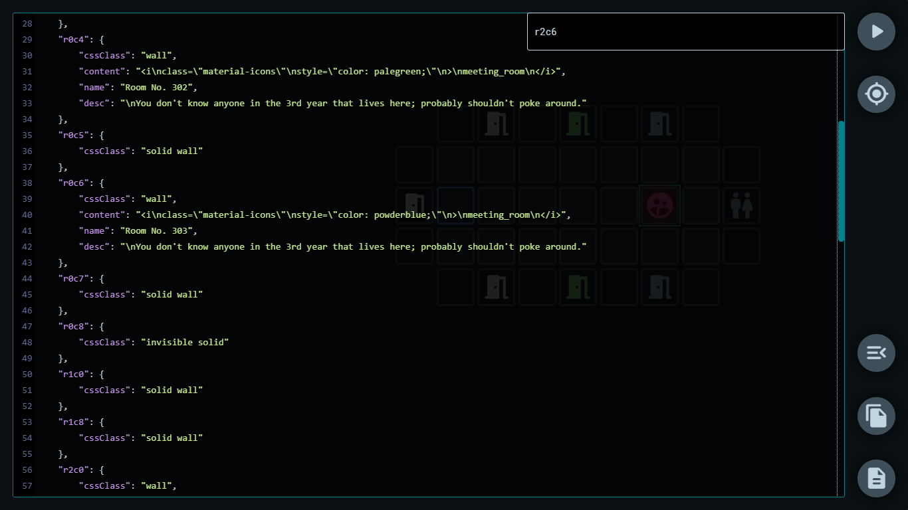

# Blocky Maps
`v1.0.0`

## Introduction

*Blocky Maps* is tool made to facilitate an interactive and easy to set-up map/world-navigation system for projects made with [Twine](http://twinery.org/) and using the [SugarCube 2](https://www.motoslave.net/sugarcube/2/) storyformat.

### The maps in game {docsify-ignore}
*(Icons are not included with the library)*  
Live demo [here](https://cyrusfirheir.github.io/BlockyMaps/#demo).

### The editor in action {docsify-ignore}

*Blocky Maps* is both an interactive app to create such maps, as well as a library which can be added to Twine projects using the SugarCube 2 storyformat to display and run them.

The system uses JSON to store and move around the data associated with a map, and is as extendable as the user wants it to be.

## Installation

Download the latest version of Blocky Maps from the [releases](https://github.com/cyrusfirheir/BlockyMaps/releases) page and extract the `BlockyMaps.[versionNumber].zip` file. This includes both the library and the offline version of the editor.

To add it to your project:

- If using the Twine app (web or desktop):

	Copy the *contents* of the following files from the `bm-library` directory into your project as mentioned:

	`bm-script.js` → `Story JavaScript`  
	`bm-styles.css` → `Story StyleSheet`  
	`bm-passage-twine.txt` → A passage titled 'bmPlayMap'.

- If using a Twee compiler ([Tweego](https://www.motoslave.net/tweego/) or [Extwee](https://www.npmjs.com/package/extwee)):

	Copy the following files from the `bm-library` directory into your project source:

	`bm-script.js`  
	`bm-styles.css`  
	`bm-passage.tw`
