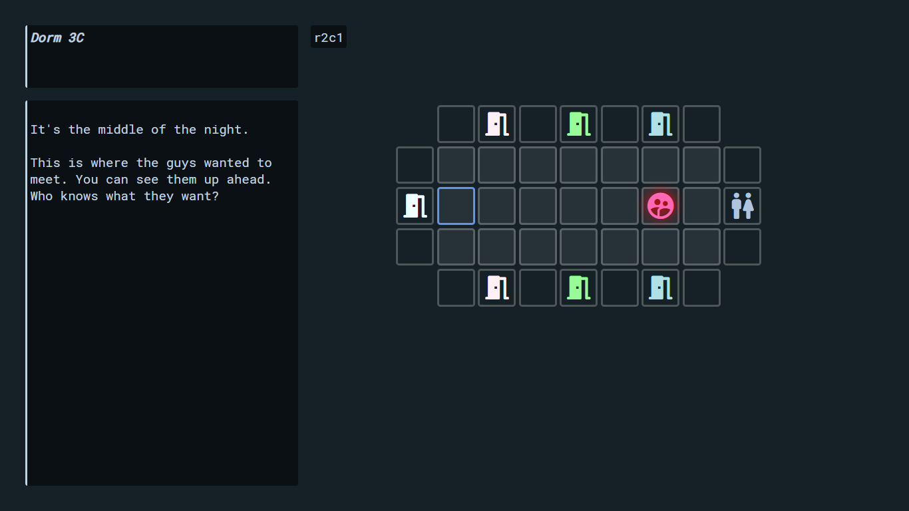
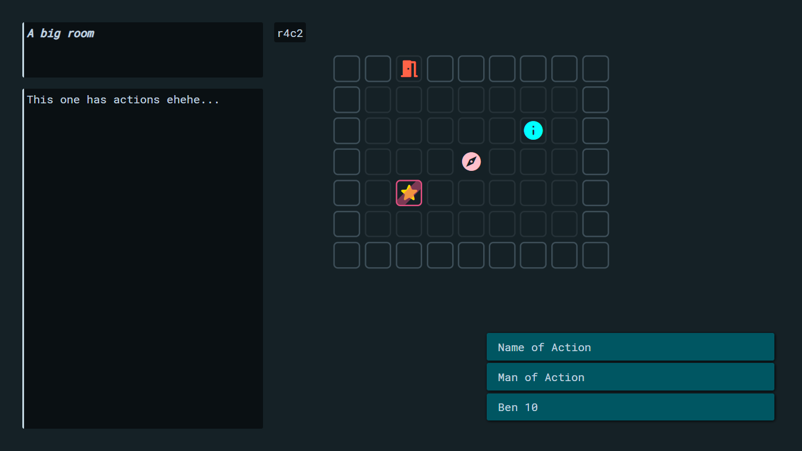
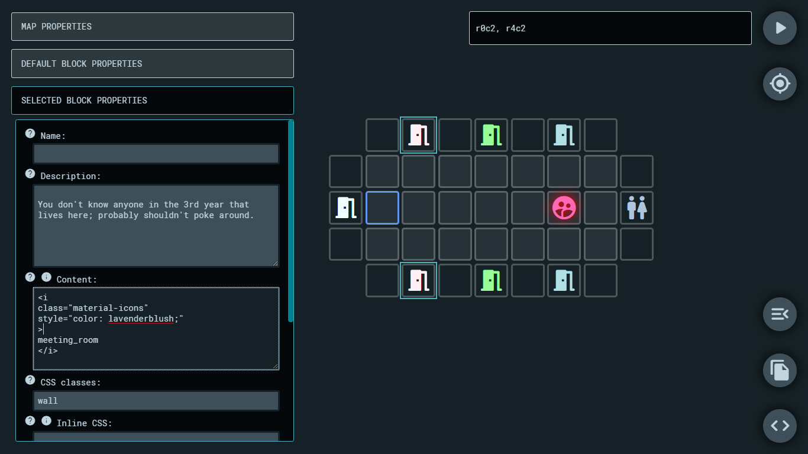
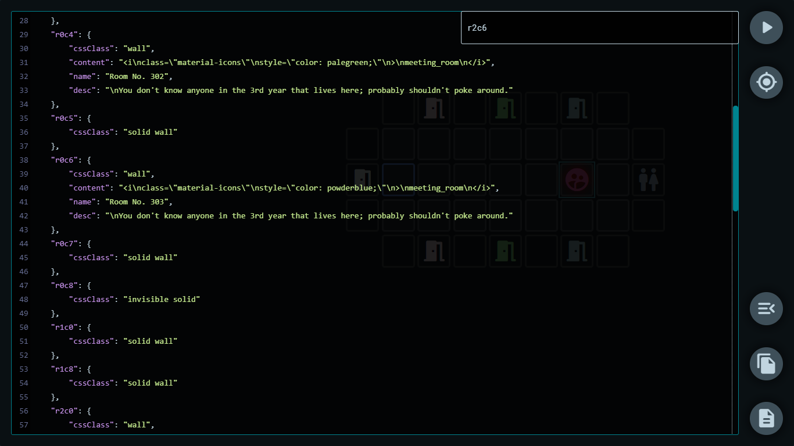

## Introduction

*Blocky Maps* is tool made to facilitate an interactive and easy to setup grid-based map/world-navigation system for projects made with [Twine](http://twinery.org/) and using the [SugarCube 2](https://www.motoslave.net/sugarcube/2/) storyformat.

### The maps in game {docsify-ignore}
*(Icons are not included with the library)*  
Live demo [here](https://cyrusfirheir.github.io/BlockyMaps/#demo) (not yet compatible with mobile devices).

### The editor in action {docsify-ignore}
Editor [here](https://cyrusfirheir.github.io/BlockyMaps/) (not yet compatible with mobile devices).

*Blocky Maps* is both an interactive app to create such maps, as well as a library which can be added to Twine projects using the SugarCube 2 storyformat to display and run them.

The system uses JSON to store and move around the data associated with a map, and is as extendable as the user wants it to be.
