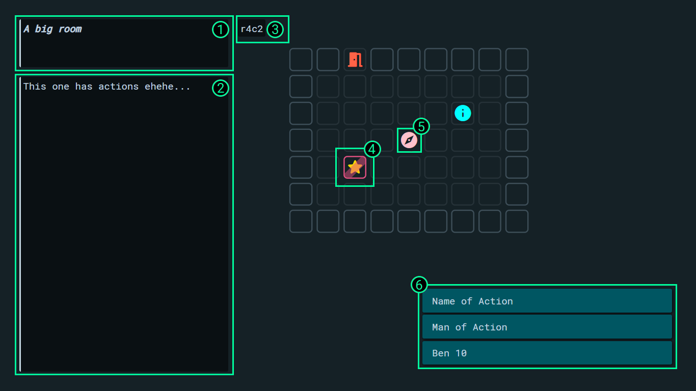

## In-game UI :id=ui

The default UI looks like this:

- `1` : Name
- `2` : Description
- `3` : Coordinates of the block on which the player is currently on
- `4` : Player indicator (pink border)
- `5` : Content of the block
- `6` : Available actions
